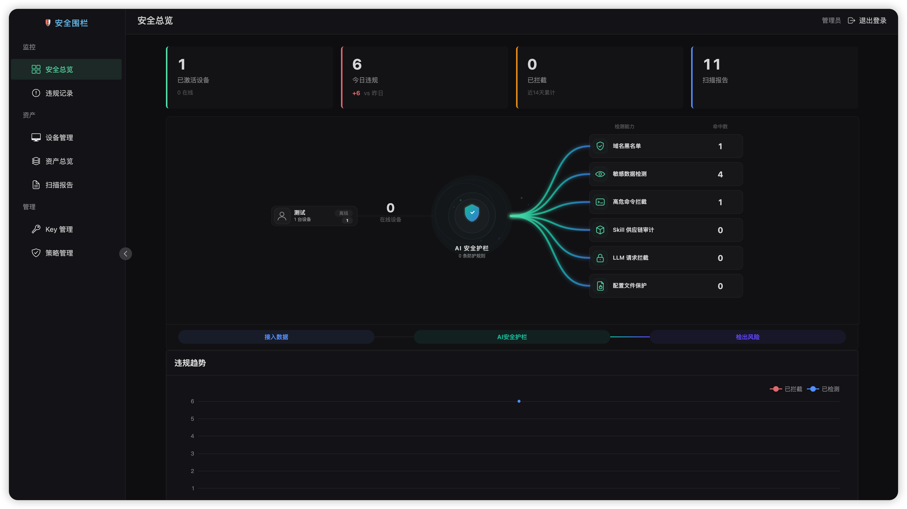
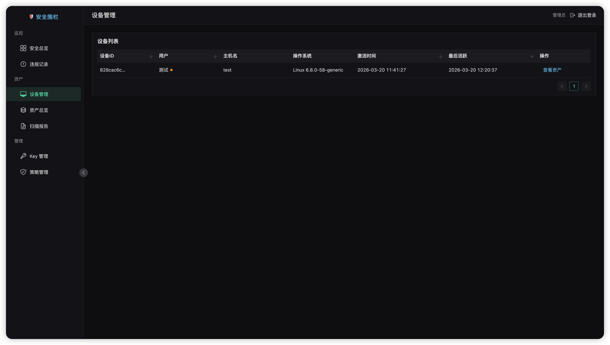
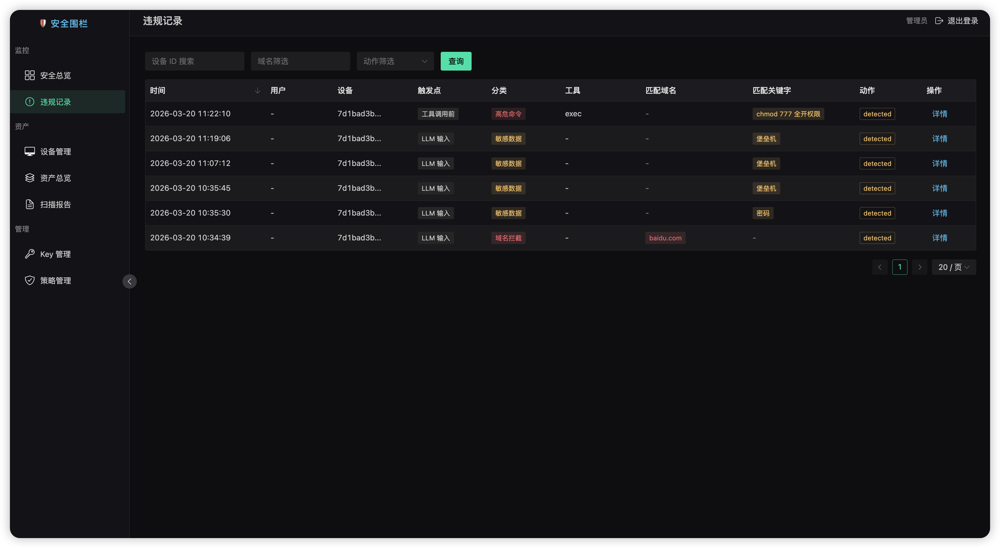
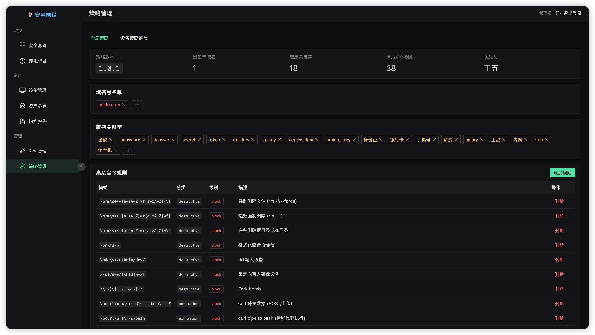
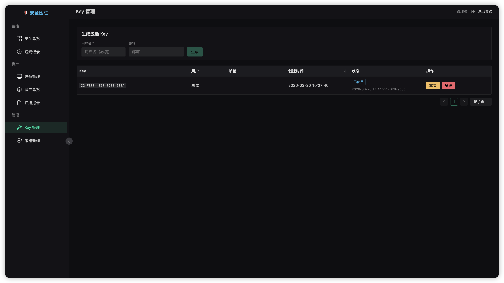

# OpenClaw 安全围栏系统

[](LICENSE)
[](https://github.com/iiiusky/openclaw-guardrail)

[English](README_EN.md) | [中文](README.md)

## 快速开始 (Quick Start)

只需一行命令即可启动 OpenClaw 安全围栏服务端：

```bash
git clone https://github.com/iiiusky/openclaw-guardrail.git
cd openclaw-guardrail
docker compose up -d
```

- 默认访问地址: `http://localhost`
- 默认管理员密钥: `docker compose exec server cat /app/secret.txt`
- 详细部署文档请参考 [INSTALL.md](docs/INSTALL.md)

## 界面预览

### 安全总览


### 设备管理


### 违规记录


### 策略管理


### Key 管理


## 系统架构

```
┌─────────────────────────────────────────────────────────────────┐
│                         用户终端设备                              │
│                                                                   │
│  ┌──────────────────────┐    ┌──────────────────────────────┐   │
│  │    OpenClaw 主程序     │    │   openclaw-guardrail Skill │   │
│  │                      │    │   （安全体检 / Skill 审计）     │   │
│  │  ┌─────────────────┐ │    │                              │   │
│  │  │ openclaw-guardrail│ │    │  - 7 步全面安全体检           │   │
│  │  │    安全围栏插件   │ │    │  - 单 Skill 安全审计          │   │
│  │  │                 │ │    │  - 报告落盘 JSON + Markdown   │   │
│  │  │ • before_tool_  │ │    └──────────┬───────────────────┘   │
│  │  │   call 拦截     │ │               │ Write 触发             │
│  │  │ • llm_input     │ │               ▼                       │
│  │  │   审计          │ ◄──── after_tool_call hook ─────────────│
│  │  │ • Fetch 拦截器  │ │     自动读取 scan JSON 并上报           │
│  │  │   (DLP检测)     │ │                                       │
│  │  │ • 域名/关键字   │ │    ┌──────────────────────────────┐   │
│  │  │ • 高危命令拦截  │ │    │      本地日志与缓存            │   │
│  │  │ • skill 安装审查│ │    │ • policy.json (策略缓存)     │   │
│  │  │ • 资产定时上报  │ │    │ • audit.jsonl (审计日志)     │   │
│  │  │ • 策略记忆注入  │ │    │ • report_log.jsonl (通信日志)│   │
│  │  └────────┬────────┘ │    └──────────────────────────────┘   │
│  └───────────┼──────────┘                                       │
└──────────────┼──────────────────────────────────────────────────┘
               │ HTTPS (上报 / 定时扫描 / 策略拉取 / 资产同步)
               ▼
┌──────────────────────────────────────────────────────────────────┐
│                     安全围栏服务端                                 │
│                  Python + FastAPI + MySQL + Redis                  │
│                                                                    │
│  ┌──────────┐ ┌──────────┐ ┌───────────┐ ┌──────────────────┐   │
│  │ 策略下发  │ │ 报告存储  │ │ 违规记录   │ │ AIG 情报代理     │   │
│  │(版本控制) │ │          │ │(分类+来源)│ │(DB优先+远程兜底) │   │
│  └──────────┘ └──────────┘ └───────────┘ └──────────────────┘   │
│                                                                    │
│  ┌──────────┐ ┌──────────┐ ┌───────────┐ ┌──────────────────┐   │
│  │ 设备激活  │ │ Key 管理  │ │ 资产管理   │ │ Web 管理后台     │   │
│  │(MachineID)│ │          │ │(分布统计) │ │(Vue3 + NaiveUI) │   │
│  └──────────┘ └──────────┘ └───────────┘ └──────────────────┘   │
└──────────────────────────────────────────────────────────────────┘
               │ 情报兜底
               ▼
       matrix.tencent.com/clawscan
```

## 核心能力

### 插件（openclaw-guardrail）

OpenClaw 原生插件，运行在 Gateway 进程内，提供实时安全管控与资产感知：

| 检测点 | 检测内容 | 动作 |
|---|---|---|
| **llm_input** | 域名 + 关键字（用户 Prompt） | detected (仅记录日志，不阻断) |
| **before_tool_call** | 域名、高危命令、Skill 安装、配置保护 | blocked (立即阻断) |
| **fetch_interceptor** | LLM 请求/响应体中的 DLP 凭据泄漏 | blocked (阻断网络请求) |
| **after_tool_call** | 扫描报告自动上报 | upload (无安全审计逻辑) |

**新增能力：**

*   **Fetch 拦截器 (DLP)**: 深度检测网络请求中的敏感凭据（如 AK/SK、Token），防止通过 fetch 泄漏。
*   **资产可见性报告**: 每 10 分钟自动采集设备上的 Skill、Plugin、Provider 及设备信息，上报服务端。
*   **审计日志系统**: 所有 Hook 交互记录到 `~/.openclaw/openclaw-guardrail/audit/audit.jsonl`。
*   **通信日志系统**: 所有云端 HTTP 流量记录到 `~/.openclaw/openclaw-guardrail/logs/report_log.jsonl`。
*   **Machine ID 复用**: 激活后生成唯一机器码，重装插件或升级时复用 ID，无需重新激活。
*   **策略本地缓存**: 策略文件缓存至 `~/.openclaw/plugin-configs/openclaw-guardrail-policy.json`，离线可用。

### Skill（openclaw-guardrail）

纯 Prompt 驱动的安全体检工具，不包含任何脚本或上报逻辑：

| 功能 | 说明 |
|------|------|
| 全面安全体检 | 7 步：平台识别 → DLP → 供应链审计 → 配置检查 → 落盘 → 输出 → 记忆 |
| 单 Skill 审计 | 云端情报 + 本地 6 步静态审计 → 结论卡片 |
| 报告落盘 | `~/.openclaw/openclaw-guardrail/json/` + `report/` |
| 策略记忆写入 | 版本化幂等写入 Agent 记忆，域名规则引导读配置文件 |

### 服务端（server）

Python FastAPI 服务，提供全方位的安全管理与数据分析：

| 模块 | 说明 |
|------|------|
| **activation** | 设备激活（Machine ID 绑定）+ Key 管理 |
| **policy** | 策略版本管理与下发（全局/设备级，支持版本回溯） |
| **asset_report** | 资产采集与分布统计（Skill/Plugin/Device 分布） |
| **reports** | 扫描报告接收 + 查询（scan_json + report_markdown） |
| **violations** | 违规事件记录（包含 hook_source 和 category 分类） |
| **stats** | 数据统计（能力分布 capabilities、14天趋势 trend） |
| **llm_check** | 服务端侧策略检测接口 |
| **web** | 静态资源托管（SPA Dashboard） |

## Web 管理后台 (New)

基于 Vue 3 + Vite + Naive UI 构建的现代化管理控制台，提供暗色主题界面。

*   **访问地址**: `http://<server-ip>:8000/`
*   **认证**: 使用 Admin API Key 登录
*   **主要功能**:
    *   **Dashboard**: 设备拓扑图、违规趋势图、活跃度统计
    *   **Devices**: 设备列表与详情，在线状态管理
    *   **Assets**: 全网 Skill、Plugin 分布查询
    *   **Violations**: 违规审计日志查询与过滤
    *   **Reports**: 安全扫描报告存档查看
    *   **Policy**: 策略版本管理与发布

**开发与构建**:
```bash
# 开发
cd web && npm run dev

# 构建
npm run build # 产物生成至 web/dist/，由 FastAPI 自动托管
```

## 项目结构

```
openclaw-guardrail/
├── server/                              # 企业安全服务端 (Python FastAPI)
│   ├── main.py                          #   入口文件
│   ├── config.py                        #   配置常量
│   ├── database.py                      #   数据库模型
│   ├── routers/                         #   API 路由
│   └── web/                             #   Web Dashboard 源码
│       ├── src/
│       ├── package.json
│       └── vite.config.ts
│
├── openclaw-guardrail-plugin/        # OpenClaw 插件 (TypeScript)
│   ├── src/
│   │   ├── index.ts                     #   插件入口
│   │   ├── fetch-interceptor.ts         #   DLP 拦截器
│   │   ├── asset-report.ts              #   资产采集
│   │   └── ...
│   ├── package.json
│   └── openclaw.plugin.json
│
├── openclaw-guardrail/               # 安全体检 Skill (Markdown Prompt)
│
├── openclaw-install/                 # 安装脚本模板
│   └── install.sh
│
├── tools/                               # 运维工具
│
├── package.sh                           # 打包脚本
├── install_plugin.sh                    # 插件安装脚本
├── docker-compose.yml                   # Docker 编排文件
└── Dockerfile                           # 服务端 Docker 镜像
```

## 安装与升级

### 首次安装 (客户端)

用户需从服务端生成的安装链接进行安装，详见 [INSTALL.md](docs/INSTALL.md#3-插件安装给终端用户)。

```bash
# 示例命令 (需替换 URL 和 KEY)
curl -sL <YOUR_COS_URL>/install.sh | KEY=<ACTIVATION_KEY> bash
```

### 升级

```bash
curl -sL <YOUR_COS_URL>/install.sh | bash
```
系统会自动复用已存在的配置和 Machine ID。

### 打包发布 (开发者)

```bash
# 发布到企业私有环境
./package.sh --enterprise https://<your-bucket>.cos.<region>.myqcloud.com --preview
```

详细打包说明请参考 [INSTALL.md](docs/INSTALL.md#4-打包与分发)。

## 策略配置

策略支持版本控制，客户端会自动缓存至 `~/.openclaw/plugin-configs/openclaw-guardrail-policy.json`。

```json
{
  "version": "1.0.5",
  "blocked_domains": ["*.malicious.com"],
  "sensitive_keywords": ["password", "ak", "sk"],
  "dangerous_commands": [
    { "pattern": "rm\\s+-rf\\s+/", "category": "filesystem", "description": "禁止删除根目录", "severity": "block" }
  ],
  "audit_log": true,     // 开启本地审计日志
  "comm_log": true,      // 开启云端通信日志
  "contacts": "",        // 联系人信息
  "scan_interval_hours": 4
}
```


## API

所有 API 请求均支持 `x-sec-device-id` 头部用于标识设备身份。

### 核心接口

| 方法 | 路径 | 说明 |
|------|------|------|
| POST | `/api/v1/activate` | 设备激活 (上报 machine_id) |
| POST | `/api/v1/auth/verify` | 验证 Admin Key 有效性 |
| GET | `/api/v1/policy/versions` | 获取策略版本历史 |
| GET | `/api/v1/llm-check` | 云端策略检测 (Text check) |

### 资产与统计

| 方法 | 路径 | 说明 |
|------|------|------|
| POST | `/api/v1/asset-report` | 上报设备资产 (Skill/Plugin/Env) |
| GET | `/api/v1/asset-reports` | 查询资产上报记录 |
| GET | `/api/v1/asset-distribution` | 资产全网分布统计 |
| GET | `/api/v1/stats/capabilities` | 违规拦截能力分布统计 |
| GET | `/api/v1/stats/trend` | 14天安全趋势统计 |

## 数据库

| 表名 | 说明 |
|---|---|
| `activation_keys` | 激活 Key |
| `devices` | 已激活设备 |
| `device_policies` | 设备级策略覆盖 |
| `violations` | 违规记录 |
| `reports` | 扫描报告 |
| `policy_versions` | 策略版本历史 |
| `asset_reports` | 资产上报快照 |
| `asset_skills` | Skills 归一化表 |
| `asset_plugins` | Plugins 归一化表 |
| `asset_providers` | Providers 归一化表 |
| `asset_device_items` | 设备-资产关联表 |
| `skills` | Skill 安全情报缓存 |
| `advisories` | 漏洞情报缓存 |

## 本地路径

| 路径 | 说明 |
|------|------|
| `~/.openclaw/extensions/openclaw-guardrail/` | 插件安装目录 |
| `~/.openclaw/skills/openclaw-guardrail/` | Skill 安装目录 |
| `~/.openclaw/plugin-configs/openclaw-guardrail.json` | 设备身份配置 |
| `~/.openclaw/plugin-configs/openclaw-guardrail-policy.json` | 策略本地缓存 |
| `~/.openclaw/openclaw-guardrail/json/` | 扫描报告 JSON |
| `~/.openclaw/openclaw-guardrail/report/` | 扫描报告 Markdown |
| `~/.openclaw/openclaw-guardrail/audit/audit.jsonl` | Hook 审计日志 |
| `~/.openclaw/openclaw-guardrail/logs/report_log.jsonl` | 云端通信日志 |

## 插件 Hook

| Hook | 状态 | 说明 |
|------|------|------|
| `before_tool_call` | ✅ 拦截 | 核心拦截点（域名、命令、Skill 安装、配置保护） |
| `llm_input` | ✅ 审计 | 用户输入检测，仅记录不阻断 |
| `llm_output` | ✅ 审计 | LLM 输出记录（审计日志） |
| `fetch` interceptor | ✅ 拦截 | HTTP 请求体 DLP 凭证检测 |
| `after_tool_call` | ✅ 上报 | 扫描报告自动上传 |
| `before_prompt_build` | ✅ 注入 | 安全策略动态注入 System Prompt |

违规事件上报包含 10 秒自动去重窗口。

## Docker 部署

推荐使用 Docker Compose 进行一键部署。

### 快速启动

```bash
docker compose up -d
```

启动后会自动创建 MySQL 数据库、Redis 缓存（可选）和安全围栏服务端（含 Web 管理后台）。服务端监听 80 端口，访问 `http://localhost` 即可进入管理后台。

### 管理密钥

`ADMIN_API_KEY` 是管理后台的唯一凭证。获取优先级：

1. 环境变量 `ADMIN_API_KEY`
2. `server/secret.txt` 文件
3. 自动生成 UUID 并写入 `server/secret.txt`（默认）

```bash
# 查看自动生成的密钥
docker compose exec server cat /app/secret.txt

# 或者指定密钥启动
ADMIN_API_KEY=my-secret-key docker compose up -d
```

### Redis 缓存（可选）

Redis 用于缓存设备状态和策略，提高响应速度。如果未配置 Redis，系统会自动降级，直接查询数据库，不影响核心功能。

### 详细部署指南

更多关于**手动部署**、**插件安装**、**打包分发**及**环境变量**的详细说明，请参考 [INSTALL.md](docs/INSTALL.md)。

## 环境变量

以下是服务端支持的主要环境变量，完整列表请参考 [INSTALL.md](docs/INSTALL.md)。

| 变量 | 默认值 | 说明 |
|------|--------|------|
| `SERVER_PORT` | `80` | 服务端监听端口 |
| `ADMIN_API_KEY` | (自动生成) | 管理后台登录密钥 |
| `MYSQL_HOST` | `mysql` | MySQL 主机地址 |
| `MYSQL_PORT` | `3306` | MySQL 端口 |
| `MYSQL_USER` | `root` | MySQL 用户名 |
| `MYSQL_PASSWORD` | `openclaw_sec_2026` | MySQL 密码 |
| `MYSQL_DB` | `openclaw_security` | 数据库名 |
| `REDIS_HOST` | `redis` | Redis 主机地址 (留空则禁用 Redis) |
| `COS_PLUGIN_URL` | (空) | 插件分发的 COS/CDN 地址 |

## 管理后台

Vue 3 + Vite + Naive UI 暗色主题管理后台。

### 页面

| 页面 | 说明 |
|------|------|
| 安全总览 | 拓扑可视化 + 统计卡片 + 趋势图 + Top 排行 |
| 设备管理 | 设备列表 + 在线状态 + 资产详情 |
| 资产总览 | Skills/Plugins/Providers 分布统计 |
| 违规记录 | 筛选 + 分页 + 详情弹窗（含上下文） |
| 扫描报告 | 按设备聚合 + 展开详情 + 扫描类型 |
| Key 管理 | 生成/吊销/重置激活 Key |
| 策略管理 | 全局策略编辑 + 设备策略覆盖（表单/JSON 双模式） |

### 开发

```bash
cd web
npm install
npm run dev       # 开发（Vite 代理到后端）
npm run build     # 生产构建
npm run preview   # 预览构建产物
```

## 文档

| 文档 | 说明 |
|------|------|
| [安装部署指南](docs/INSTALL.md) | Docker / 手动部署 / 插件安装 / 打包分发 / 环境变量 |
| [用户使用手册](docs/USER_GUIDE.md) | 终端用户安装、使用、安全体检指南 |
| [技术文章](docs/ARTICLE.md) | 项目设计思路与技术分享 |
| [贡献指南](docs/CONTRIBUTING.md) | 如何参与开发、提交代码、报告问题 |
| [行为准则](docs/CODE_OF_CONDUCT.md) | 社区行为规范 |

## 许可证

本项目采用 [Business Source License 1.1 (BSL 1.1)](LICENSE) 开源。

**免费使用**：个人、教育、研究、非营利组织、10 人以下团队。

**商业授权**：超过 10 人的企业在生产环境使用，或基于本项目提供付费服务，需联系获取商业许可。

**变更日期**：2030-03-20 起自动转为 Apache License 2.0。

## Star History

[](https://star-history.com/#iiiusky/openclaw-guardrail&Date)
