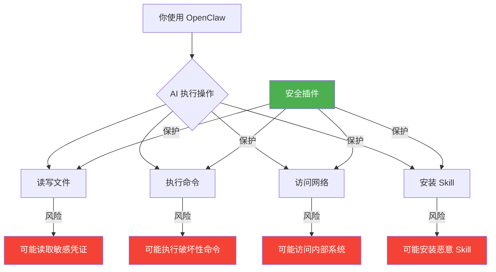
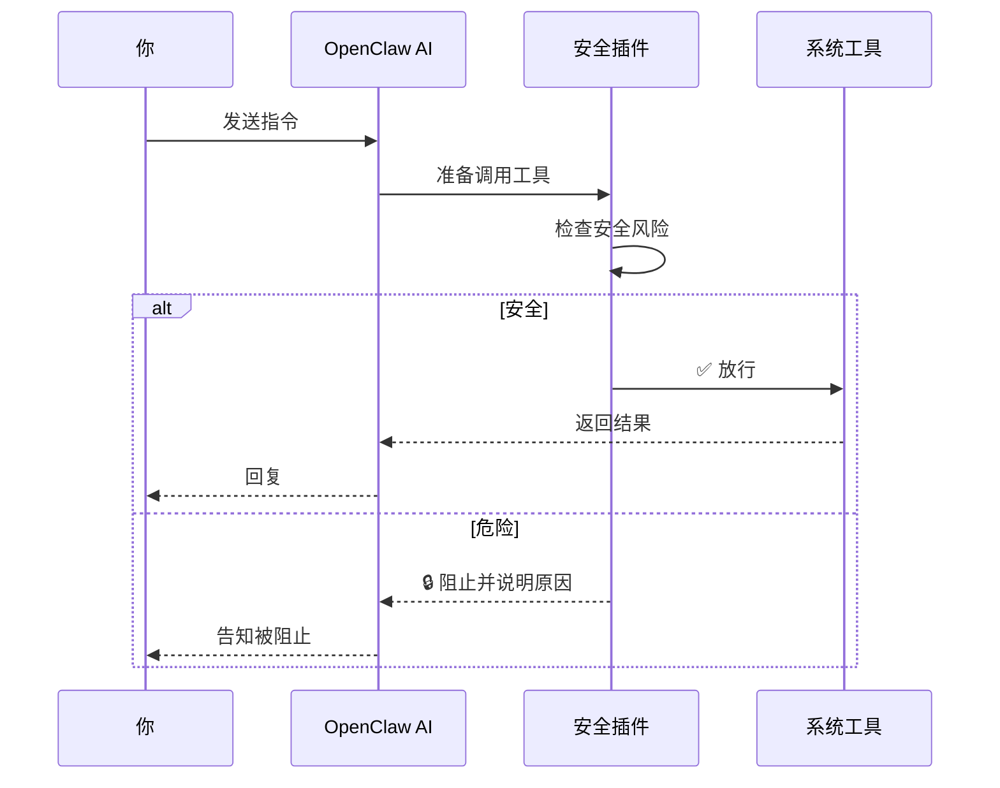
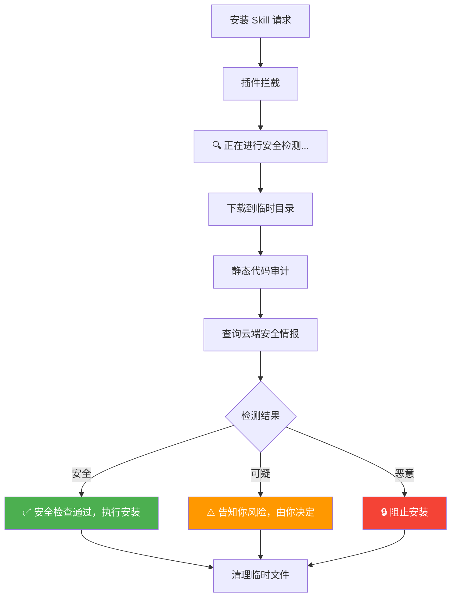
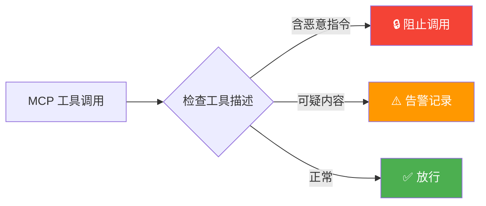
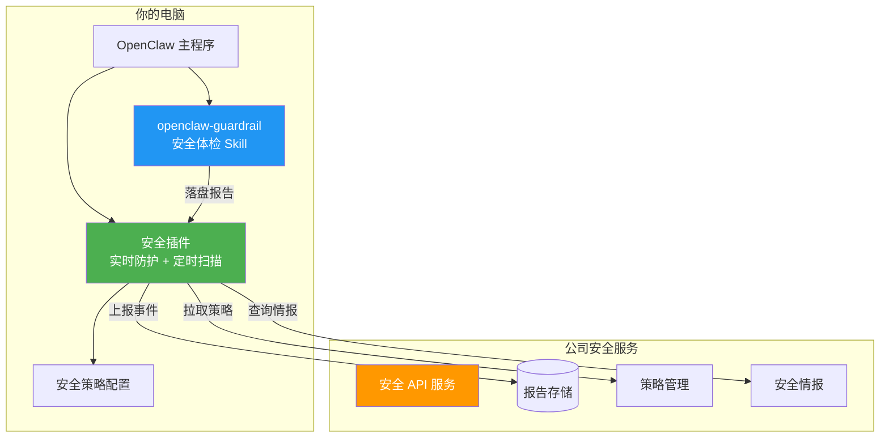

# 🛡️ OpenClaw Guardrail 企业安全插件

> 📌 本指南适用于 **macOS** 和 **Linux** 系统，暂不支持 Windows。

## 这是什么？

这是 OpenClaw 安全围栏系统的**安全防护插件**。

OpenClaw（俗称“龙虾”）正在成为日常的重要工具，但它拥有读写文件、执行命令、访问网络等高权限能力。在提升效率的同时，也带来了**数据泄露、恶意投毒、误操作破坏**等安全风险。

**为了保护公司数据安全和你的电脑安全**，安全团队开发了这款插件，它会在后台默默运行，帮你防范以下风险：

- 🔒 **数据外泄防护** — 防止 AI 将公司内部系统地址、源代码、凭证等敏感信息发送到外部，避免不经意的数据泄露
- 🛑 **危险命令拦截** — 拦截可能造成破坏的高危命令（如 `rm -rf /`、反弹 shell），防止 AI 误操作损坏你的工作环境
- 🔍 **投毒检测** — 安装第三方 Skill 或连接 MCP 服务前自动进行安全检测，防止恶意代码通过 AI 工具链植入你的电脑
- 📋 **合规巡检** — 定期检查你的 OpenClaw 配置是否安全，确保符合公司安全基线要求

> 💡 **一句话总结**：这个插件是你使用 AI 编程工具时的"安全网"——不影响正常使用，但在关键时刻阻止危险操作，保护公司和你的数据不受侵害。

## 为什么需要它？

OpenClaw 是一个强大的 AI 工具，它可以：
- 读写你电脑上的文件
- 执行终端命令
- 访问网络
- 安装第三方插件和 Skill

这些能力在提升效率的同时，也带来了安全风险：



**安全插件就是你的"安全网"** — 它不会影响你的正常使用，但会在关键时刻阻止危险操作。

## 它做了什么？

### 1. 实时防护（每次操作都检查）



| 防护项 | 说明 | 你会看到什么 |
|--------|------|-------------|
| 域名黑名单 | 阻止 AI 访问公司内部平台 | `🔒 根据企业安全策略，当前禁止连接内部平台域名` |
| 高危命令 | 阻止破坏性命令执行 | `🔒 企业安全策略已阻止此操作` |
| 敏感关键字 | 检测对话中的敏感信息 | 静默记录，不打扰你 |
| 配置保护 | 防止 AI 修改安全配置 | `🔒 禁止在对话中修改配置文件` |

### 2. Skill 安装保护

当你或 AI 要安装新的 Skill 时：



检测内容包括：
- **Prompt 注入** — Skill 是否试图劫持 AI 的行为
- **数据外传** — Skill 是否会偷偷发送数据到外部
- **敏感目录访问** — Skill 是否试图读取你的 SSH 密钥、云凭证等
- **隐蔽执行** — Skill 是否包含 `curl|bash` 等危险执行链

### 3. 安全体检

你可以随时让 AI 做一次全面的安全检查：

> 💬 **你说：** "做一次安全体检" / "安全扫描" / "security scan"

AI 会自动执行 7 步检查并给你一份报告：


报告示例：

```
# 🏥 OpenClaw 安全体检报告

📅 2026-03-18 15:30:00
🖥️ OpenClaw 2026.3.13 · linux 6.8.0
📁 工作目录: /home/user/project

| 检查项 | 状态 | 详情 |
|--------|------|------|
| 配置审计 | ✅ 通过 | 当前未发现明显风险项 |
| Skill 风险 | ✅ 通过 | 已完成供应链审计，未发现高风险 |
| 版本漏洞 | ✅ 通过 | 当前未匹配到高风险漏洞 |
| 隐私泄露风险 | ✅ 通过 | 当前未发现明显高风险路径 |
| 综合评估 | ✅ 当前未见明显高风险 | 建议保持定期巡检 |

如有安全相关问题，可联系：王五
```

### 4. MCP 工具描述投毒检测

部分恶意 MCP 服务会在工具描述中隐藏指令，诱导 AI 执行危险操作。插件会实时检测：



## 安装

> ⚠️ **安装前须知**：根据公司规定，使用 OpenClaw 的同学需要先通过 AI 安全能力考试。
> 请点击 [AI 安全能力考试](https://example.com/ai-security) 完成考试，
> 考试通过后将自动获得安装所需的激活 KEY 和安装命令地址。

拿到激活 key 后，执行一条命令即可：

```bash
curl -sL https://<公司安全服务地址>/install.sh | KEY=你的激活key bash
```

安装完成后 OpenClaw 会自动重启，插件立即生效。

### 升级

已安装过的设备升级不需要 key：

```bash
curl -sL https://<公司安全服务地址>/install.sh | bash
```

## 它不会做什么

- ❌ **不会读取你的文件内容** — 只检查文件名和路径
- ❌ **不会记录你的对话** — 只在命中安全规则时记录事件
- ❌ **不会影响你的正常使用** — 只拦截真正危险的操作
- ❌ **不会发送你的数据** — 只上报安全事件摘要（脱敏）

## 我看到了安全提示，怎么办？

| 你看到的提示 | 含义 | 怎么做 |
|-------------|------|--------|
| `🔒 当前策略禁止连接内部平台域名` | AI 试图访问公司内部系统 | 这是正常拦截，内部系统地址不应通过 AI 访问 |
| `🔒 企业安全策略已阻止此操作` | AI 试图执行高危命令 | 检查命令是否合理，如确需执行请联系信息安全团队 |
| `🔍 正在进行安全检测，请稍候...` | 正在审查要安装的 Skill | 等待检测完成，会告诉你结果 |
| `🔒 已阻止安装此 skill` | Skill 存在安全风险 | 不要安装该 Skill，联系信息安全团队确认 |

## 系统架构（给感兴趣的同学）



## 常见问题

**Q: 安装后 OpenClaw 变慢了吗？**
A: 不会。安全检查是纯本地内存匹配（微秒级），不涉及网络请求。只有命中安全规则时才会异步上报。

**Q: 可以临时关闭插件吗？**
A: 不建议。如有特殊需求请联系信息安全团队。

**Q: 插件会自动更新吗？**
A: 插件会检测新版本并在日志中提示，但不会自动更新。升级需要手动执行安装命令。

**Q: 我想安装一个被拦截的 Skill，怎么办？**
A: 联系信息安全团队评估，确认安全后会加入白名单。

## 联系信息安全团队

如有任何安全相关问题，请联系：**王五**
